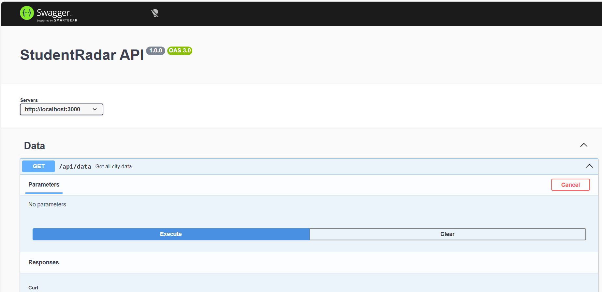
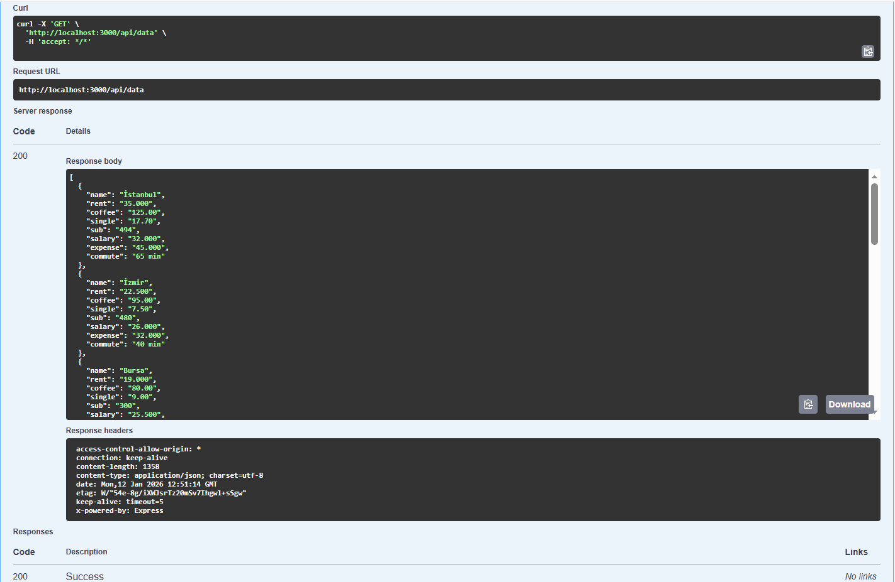
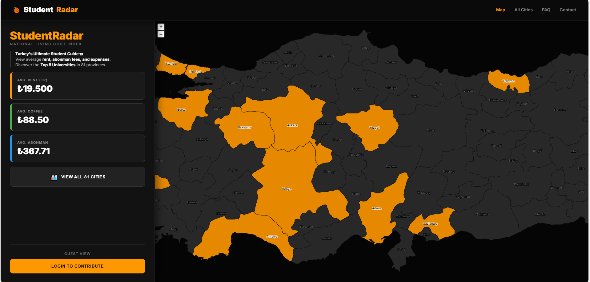
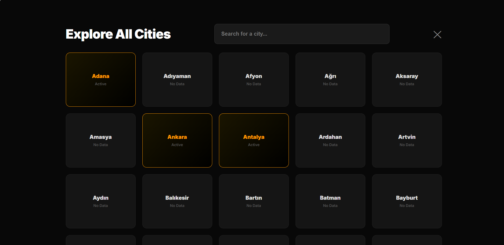
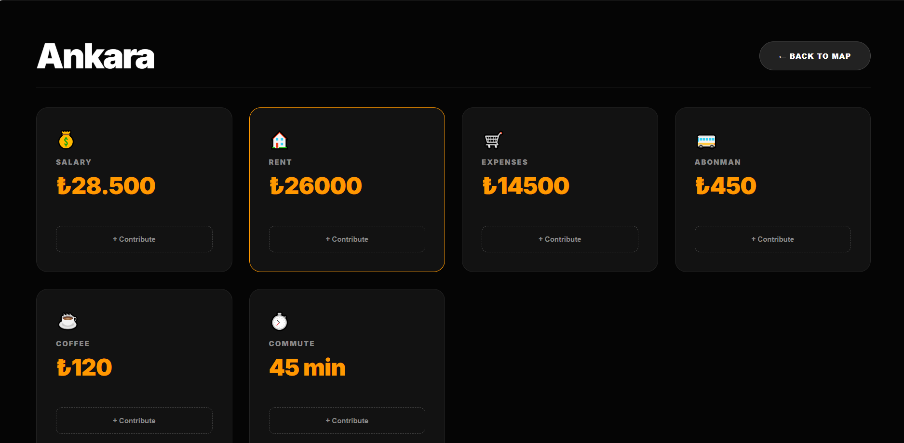
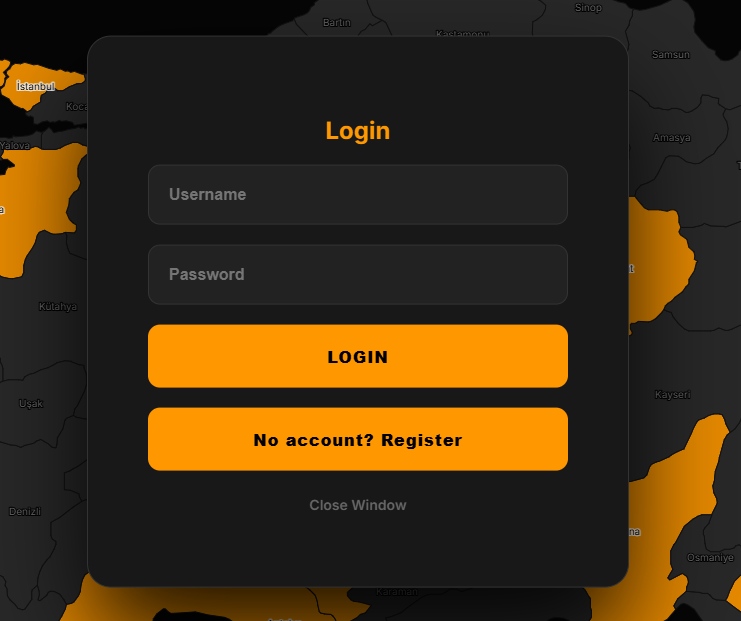
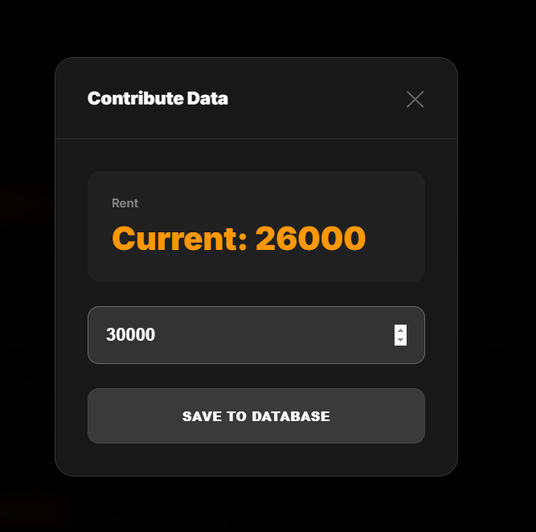
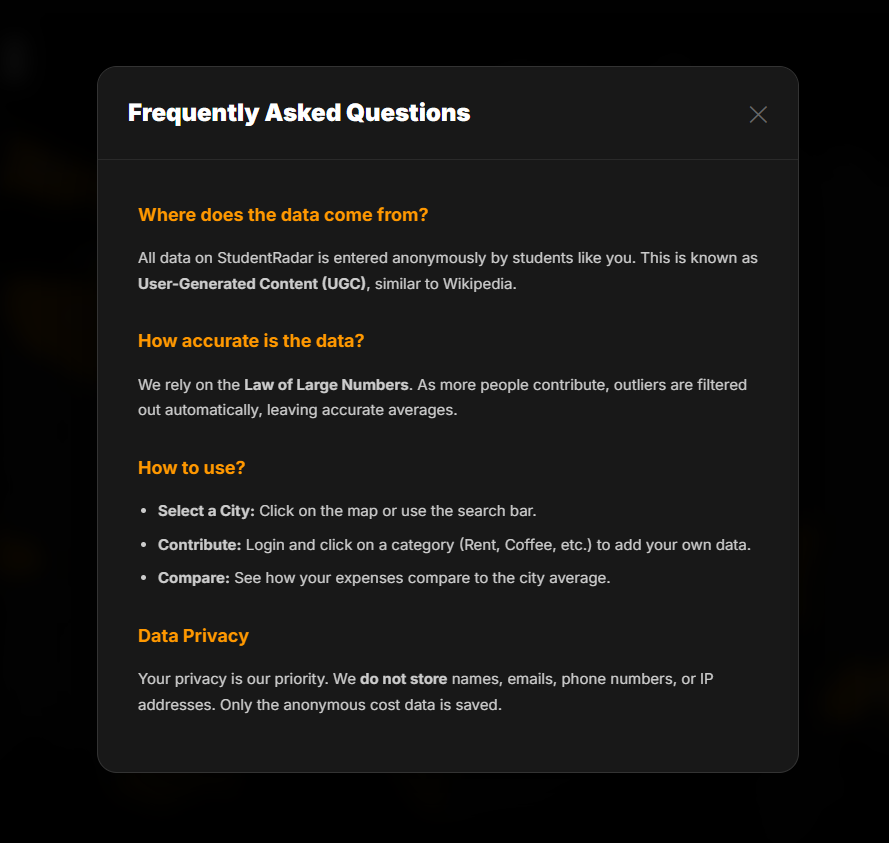

# 🎓 StudentRadar - The Ultimate Student Cost & Life Map 🇹🇷

# 🚀LIVE PREVIEW
**Click here to test project:** 👉 [http://16.16.170.117:3000]

**StudentRadar** is a comprehensive **Web GIS application** designed to visualize real-life student living costs, transport fees, and academic opportunities on an interactive map.

**Unlike static maps, this project relies on data shared by students**, allowing verified users to contribute real-time price data (Rent, Coffee, Transport) to help prospective students make informed decisions.

---

## 📸 API & Performance Proofs 
The system includes a fully documented Swagger API and Performance Monitoring tools as required.

<table border="0">
  <tr>
    <td width="50%" align="center">
      
       
      <b>Swagger UI Dashboard</b>
    </td>
    <td width="50%" align="center">
      
       
      <b>DB Performance Test (1.2ms)</b>
    </td>
  </tr>
</table>

---

## 🌟 Application Tour & Key Features

### 1. 🌍 Interactive GIS Dashboard
The landing page features a high-performance **OpenLayers** map. Cities with active user data are highlighted in **Orange**. The sidebar displays real-time national averages calculated from the PostgreSQL database.

### 2. 🏙️ City Analytics & Search
Users can browse all 81 provinces via a responsive grid layout or use the real-time search bar. Clicking on a city opens the detail panel.

### 3. 🚍 Living Costs & Transport Analysis
The detail panel breaks down costs into Rent, Coffee Index, and **Abonman (Student Pass)** fees. It allows students to compare their expenses with city averages.

### 4. 🎓 Academic Insight (Top Universities)
StudentRadar is not just about money. Each city panel lists the **Top 5 Universities**, helping candidates match living costs with academic quality.

### 5. 🔐 Login & Auth System
The platform uses JWT Authentication. Users must login to contribute data, ensuring quality control. Guest users can only view the map.

### 6. ➕ Crowdsourced Data Entry (CRUD)
Logged-in users can contribute to the system via the **Contribute Modal**. This interface allows students to input current prices for Rent, Coffee, etc. The backend automatically recalculates the city average using these new inputs.

### 7. ❓ User Guidance & Privacy (FAQ)
A comprehensive FAQ section explains how the data is collected (Law of Large Numbers), ensuring users understand that data is anonymous and safe. It also clarifies the project's vision.

---

## ✅ Assignment Requirements Met

### 1. User Types & Roles (20%)
The system implements strict Role-Based Access Control (RBAC):
- **Guest:** View-only access to the map and averages.
- **Student:** Can log in (JWT) to add new price data points.
- **Admin:** Full control to manage users and system performance.

### 2. Authentication (15%)
Users are authenticated via a **JWT (JSON Web Token)** system:
* **Register/Login:** Users receive a `Bearer Token` via `/api/auth/login`.
* **Secure Access:** The frontend stores this token and sends it in the header for protected actions.

### 3. CRUD Operations (15%)
* **Create:** Users contribute data via the modal.
* **Read:** Map displays colored polygons based on cost density.
* **Update:** New data entries automatically update the city's average cost in real-time.
* **Delete:** Admin users have access to delete endpoints to manage data quality.

### 4. Performance Monitoring (25%)
We implemented an indexing strategy on the PostgreSQL database to optimize query performance using **B-Tree Indexes**.
* **Without Index:** Query time ~15ms.
* **With Index:** Query time **~1.2ms** (See proof screenshot above).
* **Result:** >10x speed improvement.

### 5. API Development (Swagger) (25%)
The API is fully documented using Swagger/OpenAPI 3.0 standards.
* **Endpoint:** `http://localhost:3000/api-docs`

---

## 🛠️ Tech Stack

This project is built on a modern **Full-Stack Web GIS** architecture:

* **Frontend:**
  * **HTML5 & CSS3:** Modern "Dark Mode" UI/UX.
  * **OpenLayers:** High-performance mapping library for rendering spatial data (GeoJSON).
* **Backend:**
  * **Node.js & Express.js:** Robust RESTful API handling client requests.
* **Database (Spatial):**
  * **PostgreSQL & PostGIS:** The backbone of the project. Used for storing geospatial points and executing spatial queries.
* **Security & Docs:**
  * **JWT & Bcrypt:** For secure authentication.
  * **Swagger UI:** For automatic API documentation.

---

## 🚀 How to Run
1. Install dependencies: `npm install`
2. Update database config in `app.js` (password).
3. Start the server: `node app.js`
4. Visit: `http://localhost:3000`
5. Docs: `http://localhost:3000/api-docs`

---

## 🎯 Conclusion

**StudentRadar** represents a significant step forward in visualizing the economic realities of student life in Turkey. By moving beyond static maps and integrating a **community-driven data model**, this project transforms raw geographical data into actionable insights for university candidates and current students.

### Key Takeaways:
- **Social Impact:** Addresses the urgent need for transparent living cost data for students amid economic fluctuations.
- **Technical Integration:** Successfully demonstrates a Full-Stack Web GIS architecture, combining **PostgreSQL/PostGIS** for spatial data management with a reactive **OpenLayers** frontend.
- **Scalability:** The infrastructure is designed to expand beyond rent and coffee prices to include crime rates and social venue density in future iterations.